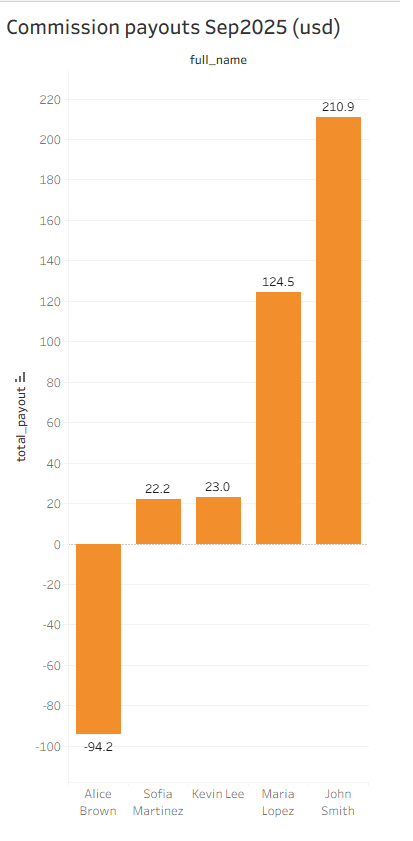

# Pace Demo – Commission Analytics (MySQL + Tableau / Power BI)

**Goal:** calculate monthly sales commissions for a logistics team with chargeback handling, order targets, manual adjustments, and payout caps.  
**Tech:** MySQL 8.0, SQL (CTE), Tableau / Power BI.

---

## Highlights
- Tiered commission rate by **margin%** (lookup in `commission_tiers`).
- **Target bonus** when monthly order target is met.
- **Manual adjustments** (positive/negative).
- **Payout cap** to limit total payout.
- Ready-to-use dashboards for Tableau / Power BI.

---